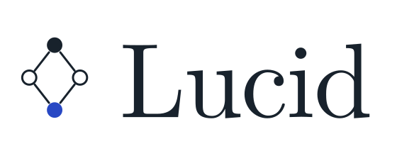

<div align="center">
  <picture>
    <source media="(prefers-color-scheme: dark)"
            srcset=".github/assets/lucid-header-dark.svg">
    
  </picture>
  <p>Lucid is an experimental programming language and toolchain developed from scratch.</p>
</div>

## Example

```
comp fun gcd(mut a: Int32, mut b: Int32): Int32 {
  loop {
    if a == b {
      break
    } else if a > b {
      mut a = a - b
    } else {
      mut b = b - a
    }
  }
  return a
}

fun main(): Int32 {
  return comp gcd(252, 105)
}
```

## Overview

- [Language](LANGUAGE.md) describes Lucid as the compiler accepts it today.
- [Architecture](ARCHITECTURE.md) follows a program through the stages of the compiler.

## Development

### Prepare

Working with the Lucid codebase requires

- ARM64 macOS
- [Xcode](https://developer.apple.com/xcode) Command Line Tools that support C++ 26
- [Bazel](https://bazel.build)

### Build

To build the compiler execute

```
bazel build -c opt //lucid/compiler:main
```

### Run

To compile and run a program execute

```
bazel run -c opt //lucid/compiler:main -- run examples/fizzbuzz.lu
```

### Test

To test all targets execute

```
bazel test ...
```

Continuous integration also runs every test optimized and under the address and
undefined behavior sanitizers, which is worth doing before pushing a change to code
that manages memory:

```
bazel test -c opt ...
bazel test --config=asan ...
bazel test --config=ubsan ...
```

### Coverage

To see which lines the tests reach execute

```
scripts/run_coverage.sh
open coverage/index.html
```

The report is drawn by `genhtml`, which comes with `brew install lcov`. Every
push also attaches it to its run on GitHub, as the `coverage` artifact, and
every push to `main` publishes it at
[sgatev.github.io/lucid/dev/coverage](https://sgatev.github.io/lucid/dev/coverage/).

### Benchmark

To run every benchmark execute

```
scripts/run_benchmarks.sh
```

A single binary can be run on its own, and reports what it measured either for
a person to read or as the JSON a benchmark tracker reads

```
bazel run -c opt //lucid/am:reg_bench
bazel run -c opt //lucid/am:reg_bench -- --format=json
```

Every push to `main` records the results, which are charted at
[sgatev.github.io/lucid/dev/bench](https://sgatev.github.io/lucid/dev/bench/).

The benchmarks in `lucid/benchmarks` time a program written once in Lucid and
once in C++, and the page charts the two side by side

```
bazel run -c opt //lucid/benchmarks/quicksort:quicksort_bench
```

### Debug

To print the abstract syntax tree derived from code execute

```
bazel run -c opt //lucid/compiler:main -- print-ast examples/fib.lu
```

To print the syntax control flow graph derived from code execute

```
bazel run -c opt //lucid/compiler:main -- print-syntax-cfg examples/fib.lu
```

To print the abstract machine control flow graph derived from code execute

```
bazel run -c opt //lucid/compiler:main -- print-am-cfg examples/fib.lu
```

## Tooling

To enable syntax highlighting in your editor install

- [nvim-lucid](https://github.com/sgatev/nvim-lucid/tree/main) plugin for [Neovim](https://neovim.io)
- [tree-sitter-lucid](https://github.com/sgatev/tree-sitter-lucid/tree/main) grammar for [Tree-sitter](https://tree-sitter.github.io/tree-sitter)

## License

Lucid is released under the [MIT License](LICENSE).
